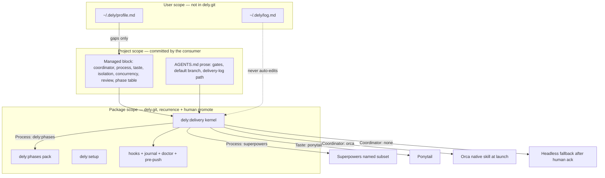

# Dely as a Composition Kernel

| Field | Value |
| --- | --- |
| Status | Draft |
| Author | Control session |
| Date | 2026-08-23 |
| Package | `dely` 0.10.0 → 0.15.0 (contract change at 0.13.0; stay off `1.0.0` until a second coordinator is observed) |
| Supersedes | “The package is a thin protocol over native capabilities” (`docs/decisions.md`, 2026-08-20/21) as the *product* claim; the four-phase skill remains, demoted to an optional process pack |

**Product constraint (product owner, 2026-08-23; research freeze, not an implementation order).** Dely does not use in-harness subagents and does not orchestrate parallel worktrees. The workflow is simple, sequential, and controllable, with a choice of harness per phase. One job at a time. If a human wants parallelism, they create worktrees themselves and run Dely independently on each; Dely does not coordinate across those checkouts.

This constraint **withdraws** draft Decision 13 (`concurrency: parallel` requires `isolation: worktree`) and drops Isolation/Concurrency as Dely profile keys. Serial-on-current-checkout is protocol, not a flip. See Decision 13 below.

**Product constraint (product owner, 2026-08-23, after three-harness probe).** Superpowers is a **habit outside Dely**, not a Dely process pack. Compatible Superpowers skills remain invocable because the harness installs them; Dely does not compose, rewrite, catalogue, or select them. Probes on Grok Build, Claude Code, and Codex CLI (same checkout, 2026-08-23) showed all nine named skills discoverable while Dely was loaded; in-session rituals (brainstorming dialogue, TDD, debugging, receiving review, verification-before-completion) compose; skills whose written procedure spawns subagents, creates worktrees, or merges/deletes worktrees must not be followed as written — that line is Dely’s serial/current-checkout identity plus Superpowers’ own `AGENTS.md` precedence, not a Dely–Superpowers bridge. This **withdraws** `Process: superpowers` from the Dely profile schema and **withdraws** the Superpowers composition procedure (Decision 7 as previously drafted). See Decision 7 below.

---

## Overview

Dely today is an opinionated four-phase protocol (`skills/delivery/SKILL.md`) plus evidence rails, packaged for Claude Code, Codex CLI, and Grok Build. That protocol **competes** with Superpowers on the same machine, freezes the maintainer’s isolation and concurrency taste as portable law, and has no user-scope overlay — so dogfooding Dely mixes personal stack choices into package rules. The public claim (“a cross-harness delivery workflow”) is indistinguishable from spec-kit / Superpowers / BMAD / GSD / Orca, none of which it should become.

**Market sentence (the claim this design makes, and the only one the README and plugin description may make):**

> Dely is a simple sequential delivery workflow across the harnesses you choose. One job at a time, on the checkout you are in. It does not spawn subagents or fan out worktrees. If you want parallelism, you create the worktrees and run Dely independently on each.

The redesign is a **thin sequential workflow + three scopes**. Dely owns **sequence, harness choice, evidence, and recurrence**. It does not own Superpowers. Taste (`ponytail`) may still be a user overlay later; Superpowers is not a Dely `Process` value. Dispatch, when a coordinator is selected, is real harness TUIs, one worker at a time, current checkout.

Plan sizing and discriminating acceptance stay in the kernel because they are **measured** (`docs/findings.md` §1; later the ninth non-discriminating row in `docs/delivery-log.md` / `docs/decisions.md`). Serial-on-current-checkout is no longer “taste frozen as law” — it is the product. Worktree fan-out is a git/Orca act the human performs; each checkout is a separate Dely run with no shared Dely coordinator.

Target user: someone who wants one controllable job, a choice of Claude Code / Codex / Grok (or the next harness) per phase, and verification that cannot be faked by an implementer who ships a thing that exists, runs, and passes. If they want Superpowers *with* subagents, Orca-style parallel worktrees as the workflow, spec-kit SDD, BMAD personas, or GSD’s 29 skills, Dely is the wrong product.

---

## Background & Motivation

### Current state

The portable contract is `skills/delivery/SKILL.md` (~393 lines). It classifies Routine / Planned / Critical, runs `design → implement → review → release`, and rejects Superpowers `writing-plans` / `executing-plans` because those skills mandate subagent-driven execution, two-to-five-minute steps, per-task commits, and worktrees (`docs/decisions.md` Rejected table; `docs/options.md` Layer F).

Project pins live in one managed block in `AGENTS.md`, written by `dely:setup` between `<!-- dely:begin -->` and `<!-- dely:end -->`. The block is a coordinator line plus a four-row `Phase | Harness | Model | Effort` table. `bin/delivery-doctor` parses that shape (`tests/managed-block-contract.sh`). There is no user-scope file.

Rails that remain load-bearing:

| Rail | Path | Job |
| --- | --- | --- |
| Identifier injection | `hooks/session-start-context.sh` | `SessionStart` resolves HEAD, branch, tree, default ref, merge base from `git` at use-time; stale remote-tracking refs labelled. No network I/O. **Always exits 0**; a session must never fail because of this hook. |
| Evidence journal | `hooks/post-tool-journal.sh` + `bin/delivery-evidence` | `PostToolUse` / `PostToolUseFailure` record command + verbatim output. OTel lacks output text (`docs/options.md` Layer B). **Always exits 0**; never writes to stdout. |
| Doctor | `bin/delivery-doctor` | Wiring check: hooks parse, Grok adapter, managed block, journal presence. **Exit 0 all checks pass, 1 at least one failed.** This series extends the profile-shape job; it does not add Enter-recovery or Orca-liveness. |
| Push guard | `git-hooks/pre-push` | Refuses push to `main`/`master`, deletion, non-fast-forward. `cc-safety-net` does not cover push-to-main (`docs/findings.md` §10). |
| Grok adapter | `hooks/grok-hooks.json.template` → `~/.grok/hooks/delivery.json` | Grok discovers plugin hooks and dispatches none (`docs/findings.md` §30). Glue, not product. Doctor already checks it. |

This repository’s own `AGENTS.md` block pins Orca + Claude Code control + Grok implement/review/release. Review is a fresh session with no phase-implied sandbox; Grok review is pinned `--always-approve` in prose *outside* the block.

### Pain

1. **Process competition.** Superpowers `using-superpowers` fires every conversation **and** the managed block demands `dely:delivery`. The delivery skill treats Superpowers planning skills as rejected protocol rather than as a selectable process pack. Two products argue on one machine. Superpowers 6.3.0 `writing-plans` embeds `REQUIRED SUB-SKILL: … subagent-driven-development` in every plan file; `executing-plans` redirects to SDD when subagents exist; `requesting-code-review`’s “How to Request” is “Dispatch a `general-purpose` subagent.” A contractual veto that still *invokes* those skills loses.

2. **Taste frozen as law.** “No worktrees, serial” was a founding-ADR protocol rule. It is the maintainer’s working style and the right *default*. It is the wrong thing to moralise in a skill other people install. Orca already offers worktrees; declining them is a profile choice (`docs/decisions.md`, “Orca owns dispatch… Workers share the repository’s own checkout”). **Plan sizing is not the same class** — it is the strongest proven lever in `docs/findings.md` §1 and stays kernel.

3. **Two scopes, not three.** Claude Code already splits user (`~/.claude/settings.json`, `~/.claude/CLAUDE.md`) / project (`.claude/settings.json`, `CLAUDE.md`, `AGENTS.md`) / plugin. `cc-safety-net` splits user / project / GitHub rulebook. Dely has package (`skills/`, `hooks/`, `bin/`) and project (managed block) only. Dogfooding therefore has nowhere to put “I always want Superpowers + Ponytail + serial + no worktree” except `skills/delivery/SKILL.md` or this repo’s `AGENTS.md` — the first pollutes the product, the second does not follow the maintainer onto the next project.

4. **Glue treated as product.** The 90-second `input_accepted` → one Enter recovery (`docs/decisions.md` 2026-08-22) is an Orca workaround with a deferred native trigger (`input_submitted`); it is pinned by `tests/dispatch-submission-contract.sh`, **not** by doctor. The Grok adapter is a harness bug; doctor already checks `~/.grok/hooks/delivery.json`. Research docs (`docs/decisions.md` ~2.3k lines, `docs/findings.md` ~2.3k, plus `options.md` / `harness-surface.md` / README) dwarf runtime (~1.6k lines of skills, bins, hooks, tests). That ratio is a product smell: the kernel is not small because the repository is mostly arguing with itself.

### What the 41-plan record actually earned

From `docs/findings.md` §1 (captured 2026-08-19) and later in-repo deliveries:

- Largest class **at capture**: an acceptance instrument that cannot discriminate a pass from a failure — **eight** plans (`docs/findings.md` §1). The **ninth** is this repository’s own `setup-skill-and-managed-block` / `counterexample-column` story (`docs/delivery-log.md`, `docs/decisions.md` 2026-08-21). Baseline-red is insufficient. Superpowers/TDD do not require a “wrong implementation that still passes” column; Dely does, because of that record.
- Second-largest at capture: **environment or config not pinned** (a gate went green or red for reasons outside the candidate). Unpinned model or effort is the operational slice the phase table exists to kill; it is not the whole class.
- **Splitting** is the strongest proven lever (§1: one plan holding a shared primitive and eighty call sites failed three times; split in two, both accepted). Allowed-scope omissions cost three plans. Both stay in the kernel (Decision 21).
- Automating handoff does **not** reduce round count. It removes toil and encoding damage. Round count is spec/verification quality.
- Recurrence works, slowly: two of seven corrections after a third occurrence. One incident is not policy. AI may propose; a human promotes. Auto-evolving skills are rejected (`docs/decisions.md` Rejected; `docs/options.md` Layer G).

ETH Zurich (Gloaguen, Mündler, Müller, Raychev, Vechev, [arXiv:2602.11988](https://arxiv.org/abs/2602.11988), 2026): LLM-generated `AGENTS.md` **reduces** success ~3% and **increases** cost ~20%. Developer-written files help only when they state what the agent cannot infer. This design therefore **forbids** auto-writing `AGENTS.md` and auto-mutating the live skill or user profile from session telemetry.

Hacker News consensus (`docs/options.md` discovery sources: items 46993479, 47862274) agrees with `docs/findings.md`: people abandon heavy frameworks; round-loss is spec/verification quality, not a missing coordinator. Dely must not grow a coordinator, a persona graph, or a 29-skill SDLC to chase a market that is leaving those products.

---

## Goals & Non-Goals

### Goals

1. State a market sentence that is true (Overview) and make the plugin description, README, and `dely:delivery` frontmatter say that sentence instead of “cross-harness four-phase delivery workflow.”
2. Serve the maintainer’s stack as a **first-class profile**, not a special case: Superpowers process, Ponytail taste, Orca TUIs, shared checkout, serial, independent review as a fresh coordinator session. The same profile must work when dogfooding Dely.
3. Split **user / project / package** scopes so personal customisation cannot land in `skills/delivery/SKILL.md`, and package changes still require recurrence + human promote.
4. Keep the measured kernel: discriminating acceptance, plan sizing, allowed-scope carry, review reproduction (“Reproduce, do not accept”), recurrence, tool-layer evidence, thin protocol over a native coordinator, per-phase harness/model/effort pins.
5. Compose with process and taste skills already installed **on the Control harness**. Override dispatch with an **implementable procedure** when a coordinator is selected: named invoke list, named do-not-invoke list, plan-file rewrite, one TUI per phase-table slot, kernel worker-entry so AGENTS.md cannot nest Control, worker prompts that **inline** TDD/taste/review-reproduction rather than naming plugins the worker harness may not load.
6. Demote today’s four-phase skill to optional process pack `dely:phases`. Do not delete it overnight.
7. Serial on the current checkout is **protocol**. Dely never creates worktrees and never dispatches overlapping workers. Parallelism, if wanted, is a human-created worktree with an independent Dely run. No Isolation/Concurrency profile keys.
8. Hide Herdr until a real Herdr-selected plan exists. For 0.11–0.15 the closed Coordinator enum is `orca | none` only (`Orca` accepted in transition). Setup does not offer Herdr even if `command -v herdr` succeeds. Doctor does not treat `herdr` as a legal slug. The first real Herdr-selected plan is an observation-owned unit **after** this series; never stack Herdr with Orca.
9. Extend doctor’s **profile-shape** job (merge, resolved print, overlay grammar). Do not add Enter-recovery or Orca-liveness. Keep the Grok adapter as a wiring check. Hooks keep always-exit-0; doctor exits 1 on FAIL.
10. Ship as independently reviewable PRs, each with an acceptance instrument that rejects a wrong implementation that exists and passes.

### Non-Goals

- Not spec-kit (constitution, stacked presets, specify/plan/tasks/implement/converge).
- Not Superpowers (composable process skills). Dely *invokes a named subset*; it does not replace them and does not load the subset that owns subagents, worktrees, nested reviewers, or merge.
- Not Superpowers-with-subagents. If the user wants `Task` / `subagent-driven-development` as the worker surface, Dely is the wrong product (`Coordinator: none` + `Review: none` is the escape, after which they should probably uninstall Dely).
- Not cc-sdd / Kiro (17 skills, per-task independent review) as a Dely mode. Superpowers task *checkboxes* may run inside one implement TUI; they are not extra dispatches.
- Not BMAD (personas + YAML workflows) or GSD (meta-prompting, 29 skills, fresh context per task).
- Not Beads / Gas Town (agent issue/memory graph).
- Not Orca or Herdr. Dely does not become an orchestrator, mailbox, TUI, DAG, or pane multiplexer. **Not offering Herdr in 0.11–0.15.** The first real Herdr-selected Dely plan is the trigger to add the slug, a bounded probe, and an options.md rank-2 row — an observation-owned unit after this series, never stacked with Orca.
- Not a plugin manager and **not a generic skill router**. Closed `Process` / `Taste` / `Coordinator` enums. Setup offers a name only via a bounded named probe in the setup skill. No walk of `~/.claude/plugins`, `~/.codex`, `~/.grok`, or random skill trees. Unknown Process/Taste is a doctor **warn**; Control does not invoke it.
- Not `intellectronica/ruler`. Still pending in `docs/options.md`; not this design.
- Not auto-written `AGENTS.md`, auto-mutated skills, or a self-adapting engine (Gloaguen et al. 2026; recurrence rule).
- Not a user-scope write into `~/.claude`, `~/.codex`, or `~/.grok` except the already-documented Claude Code `CLAUDE.md` `@AGENTS.md` offer.
- Not deleting `dely:phases` in the first PR, not moving the journal into `~/.dely/`, not shrinking the journal to output-only (OTel still lacks output text), not a sandbox-by-default for review.
- Not claiming every coordinator × harness pairing is proven. Headless `claude -p` / `codex exec` / `grok --prompt-file` remains the fallback only when Coordinator is `none`, or the selected coordinator is unavailable and the human accepts.
- Not freezing Orca CLI flags in Dely. Load the native skill at launch (`orca skills get orchestration` or the harness equivalent). Map onto `succeeded|failed`; put Dely dispositions in the file.

---

## Key Decisions

Each decision is the thing an implementer must not re-litigate inside a PR. Rationale is short; the Proposed Design section holds the mechanism.

1. **Product is a composition kernel, not an SDLC.** The four-phase workflow becomes optional pack `dely:phases`. The public claim is the Overview sentence. *Rationale:* competing with Superpowers on process made Dely a worse Superpowers and a worse Orca. The 41-plan record earned evidence, recurrence, plan sizing, and dispatch discipline, not a unique brainstorming ritual.

2. **Three scopes: user / project / package.** User overlay lives at `~/.dely/profile.md` (and `~/.dely/log.md`), never committed to `dely.git`. Project facts live in `AGENTS.md` (managed block + prose outside it). Package skills and rails change only when this repository’s `docs/delivery-log.md` shows recurrence and a human promotes. *Rationale:* Claude Code and `cc-safety-net` already split these layers; Dely’s missing user layer is why dogfooding pollutes `SKILL.md`.

3. **One user-overlay path.** `~/.dely/profile.md`. Not XDG, not `~/.claude`, not a second in-repo managed block. *Rationale:* one home per fact; the maintainer is on macOS where `XDG_CONFIG_HOME` is usually unset; setup already refuses to own `~/.claude` except the `CLAUDE.md` offer.

4. **Doctor is the merge implementation.** Precedence: kernel defaults → overlay fills gaps → project wins if set. Overlay cannot supply gates, default branch, artifact paths, or delivery-log path (closed denylist of labeled keys). Kernel boot runs `bin/delivery-doctor` (or `--resolved-profile-only`) and **cites the printed Resolved profile lines**. Control does not re-parse the two files in prose. *Rationale:* this package’s record is that lexical/prose merge is where “reports as fine” lives.

5. **Kernel defaults (when neither overlay nor project sets the field):** `Coordinator` none (unless setup discovers and the human chooses); `Process` `dely:phases` (backward compatible with 0.10.0); `Taste` none; `Isolation` none; `Concurrency` serial; `Review` `coordinator-fresh-session` when Coordinator ≠ none, else none; `Safety` **omitted** (recommended in docs, not silently on). Resolved print shows `Safety: (omitted)` rather than coercing to `none`. *Rationale:* isolation/concurrency match the maintainer and the 41-plan record as *defaults*; Process defaults to the pack that exists today so a project with no overlay does not suddenly require Superpowers.

6. **This repository’s managed block does not name Superpowers.** Pins stay coordinator + phase table (Orca, Claude Code control, Grok implement/review/release). Superpowers, if installed, is the maintainer’s harness plugin set, recorded nowhere in Dely’s schema. *Rationale:* Decision 7. Writing `Process: superpowers` into `AGENTS.md` would conscript every worker into a pack Dely does not own.

7. **Superpowers is outside Dely.** Dely does not list Superpowers in its profile, does not invoke Superpowers as protocol, does not rewrite Superpowers plan headers, and does not ship a compose procedure. A human (or a session that already has Superpowers installed) may still call Superpowers skills; that is harness behaviour, not a Dely feature. Dely’s serial / current-checkout / no-subagent / no-Dely-worktree rules still apply when Dely owns delivery, because Superpowers yields to `AGENTS.md`. In-session Superpowers rituals that do not spawn workers (TDD, debugging, receiving review, verification, Control-session brainstorming) are allowed. `writing-plans` / `executing-plans` / `requesting-code-review` / `finishing-a-development-branch` may be *read*; their dispatch, worktree, and merge branches must not be *followed* while Dely owns the run. *Rationale:* product owner after 2026-08-23 probes on Claude Code, Codex, and Grok. Composing Superpowers inside Dely would make Dely a worse Superpowers and a second orchestrator. Leaving it outside keeps Dely small and still lets the maintainer use the useful half.

8. **Dispatch override is the only process-skill veto, and its cardinality is frozen.** When Coordinator ≠ none, workers are coordinator interactive harness TUIs with model and effort pinned from the phase table. **One coordinator TUI per phase-table slot per plan**, not one TUI per Superpowers checkbox. Tiny steps and per-task commits may run *inside* the implement TUI. Wrapping `claude -p` / `codex exec` / `grok --prompt-file` in a visible shell is still not a TUI. *Rationale:* this is the product; without cardinality, an implementer honestly dispatches N times the 90s Enter recovery.

9. **Independent review default is `coordinator-fresh-session`, and the reviewer reproduces.** A new coordinator Run/session that receives contract, candidate, and evidence, does not implement, and does not edit the candidate. No phase-implied sandbox. **Do not load** `requesting-code-review` into that worker. Map findings onto Dely dispositions. Kernel review text, independent of Process: **“Reproduce, do not accept. Run the gates yourself. A claim you did not reproduce is not evidence.”** `Review: none` is legal and requires an explicit human ack before release. *Rationale:* Superpowers’ reviewer skill is a `general-purpose` subagent dispatch. Reproduction is how re-review caught defects after accepting the implementer’s word (`skills/delivery/SKILL.md` today). Under the maintainer profile the review TUI never loads `dely:phases`, so that sentence cannot live only there. Same promotion as Decision 21 for plan sizing.

10. **Counterexample column stays in the kernel for Planned work, including under Superpowers.** The four-column table (Requirement / Instrument / Counterexample / Observed red) is a Dely gate. “The feature is absent” is still not a counterexample. Kernel keeps the heading `### Acceptance` (tests pin it). *Rationale:* eight plans at capture plus a ninth in this repo; TDD’s red-green loop does not encode “wrong implementation that still passes.”

11. **`dely:phases` is a separate skill**, `skills/phases/SKILL.md`, invocable as `dely:phases`. Heading ownership is the appendix table: every current `##` / `###` in `skills/delivery/SKILL.md` lands in kernel, phases, or delete. Kernel keeps `### Launching a worker` and `### Model and effort per phase` as the `tests/dispatch-submission-contract.sh` awk bounds, plus new `## Worker sessions` (worker-entry + review reproduction). Routing may move with `## Phases`; worker-entry must not. *Rationale:* a Superpowers user must not load four-phase prose; tests must not break on a heading rename; a Superpowers worker must not need `dely:phases` to know it is a worker.

12. **Closed enums for any later series.** `Coordinator` = `orca` \| `none` (`Orca` accepted in transition). `Process` is **not** `superpowers`. If a Process key exists at all, it is Dely’s own workflow (`dely:phases` / today’s delivery skill), not a third-party pack. Do **not** offer Herdr. Doctor stores no Superpowers catalogue. *Rationale:* Superpowers-outside (Decision 7); Herdr still unobserved.

13. **Dely has no parallel mode and no worktree mode.** One job, current checkout, sequential phases. Control does not `worktree create` for workers, does not start a second implement/review TUI on the same checkout while one is live, and does not spawn in-harness subagents. A human may create git/Orca worktrees and run Dely in each; those runs do not share a Dely Run, mailbox, or profile merge. Isolation/Concurrency keys from earlier drafts are **withdrawn**. *Rationale:* product owner, 2026-08-23. Superpowers, cc-sdd, and Orca already own parallel/worktree graphs. Dely’s edge is controllability. DIY worktrees keep an escape without Dely becoming an orchestrator.

14. **Handoff maps onto the coordinator’s current completion signal; Dely does not freeze Orca flags.** Load Orca’s native skill at launch (`orca skills get orchestration`). Observed in this repo (`docs/findings.md`): `orca orchestration send --dispatch-capability dcap_… --type worker_done --outcome succeeded` with payload `{taskId, dispatchId, outcome: "succeeded"|"failed"}`; the injected preamble forbids encoding failure in prose only. Current public Agent Guidance also names optional `--files-modified` and optional `--report-path`. Kernel rules that do not depend on a flag remaining present: `--outcome` is only `succeeded|failed`; Dely `Status` / `Disposition` live in the **file** (session scratch); mailbox `--body` is the path to that file plus a one-line outcome, **never** the file contents; pass `--files-modified` / `--report-path` only if the skill loaded at launch still names them. Headless fallback writes the same file as today’s result path. PR3 keeps today’s handoff template in the kernel; PR4 only changes where the body lives and forbids mailbox duplication. *Rationale:* inventing a required `--report-path` Control then waits on is the reports-as-fine shape already paid for on doctor and `input_accepted`.

15. **Two-stream promotion is kernel policy in PR3.** User-stream observations go to `~/.dely/log.md` (shape finished in PR4) and must not be edited into package skills. Package-stream observations go to this repo’s `docs/delivery-log.md`. A package skill changes only on recurrence in *that* log plus human promote. Neither stream auto-edits `SKILL.md` or `~/.dely/profile.md`. Default to user stream when unsure. *Rationale:* PR3 dogfood otherwise has no home for taste vs kernel observations.

16. **Setup still does not install and does not enumerate other plugins.** Bounded probes only (Proposed Design). It never writes `~/.dely/profile.md` unasked (same shape as the `CLAUDE.md` offer). Moving Process/Taste *into* the managed block supersedes the 2026-08-20 “project-owned extensions… record that outside the block” sentence; that supersession is a dated stub in `docs/decisions.md` in **PR3**. Discovering them by walking other plugins’ trees is a second supersession this design does **not** make.

17. **Transport recovery is not product.** `input_accepted` + 90s + TUI read + one Enter stays documented in the kernel launch section with the existing deferred trigger (`input_submitted`). Doctor does not grow a check for it beyond the existing `tests/dispatch-submission-contract.sh` prose contract. Grok adapter stays glue; doctor still fails if Grok is on `PATH` and `~/.grok/hooks/delivery.json` is missing. `pre-push` stays. Journal shrink-to-output-only waits on OTel growing output text — not a PR in this series. This series does not edit `hooks/session-start-context.sh` or `hooks/post-tool-journal.sh`.

18. **Old managed blocks remain legal until `dely:setup` is re-run.** Doctor treats a 0.10.0 block (heading + `Coordinator:` + four-row table) as well-formed and applies kernel defaults for missing profile keys. Missing Isolation/Process is not a FAIL on an old block. A *new* block that setup writes must include Isolation and Concurrency. *Rationale:* setup is not a precondition for delivery today; do not break consumers who never re-ran setup.

19. **No auto-written `AGENTS.md` beyond the human-chosen managed block.** Gloaguen et al. 2026. Setup writes only what the human selected. Prose outside the markers stays the project’s.

20. **Stay on 0.x.** `0.11.0` PR1, `0.12.0` PR2, `0.13.0` PR3 (public claim + compose contract), `0.14.0` PR4, `0.15.0` PR5. Every PR bumps **both** plugin manifests and the `tests/managed-block-contract.sh` version pin. Not `1.0.0` while a second coordinator is unobserved. Open questions in this design are resolved (roles observation; Herdr hidden; Codex `defaultPrompt` in PR3). *Rationale:* same versioning ethic as the 0.5.0 rename decision; a missing manifest bump is a red closure gate.

21. **Plan sizing and allowed-scope carry stay in the kernel, independent of Process.** One implement TUI finishes one coherent review unit; split first when independent owners, an intermediate checkpoint, or no behaviourally coherent review. Allowed scope always carries the colocated test of an allowed source file, any registry test enumerating what the plan adds, and any document owning an allowed path; a file the plan’s own tasks require is inside scope. Superpowers 2–5 minute steps do not become extra dispatches. *Rationale:* strongest measured lever and a three-plan loss; not a side effect of moving `## design` into `dely:phases`. Dropping them under the maintainer profile would drop the lever on the repo that earned it.

22. **Worker entry is kernel. A worker selects the role it was sent to and does only that role; it does not re-run Control compose/dispatch.** `dely:delivery` still loads (AGENTS.md says Planned or Critical work must invoke it; implement/review/release TUIs are Planned work). First kernel action: if this session was launched as a worker — live coordinator preamble, or the prompt file names implement/review/release as this session’s role — take the worker path. Do not classify-as-Control, do not invoke Superpowers compose, do not dispatch further TUIs. Execute that role under kernel worker obligations (handoff, journal cite, counterexample red, dispositions, reproduce-do-not-accept on review, no `requesting-code-review`, no `finishing-a-development-branch`). Routing (`design → implement → review → release`) may live in `dely:phases`; the worker-entry sentence must not. *Rationale:* a Grok implement TUI that obeys AGENTS.md and re-runs compose is nested Control, which is the competing product. Superpowers User Instructions say AGENTS.md outranks skills; the fork has to live in `dely:delivery` itself, not in `dely:phases` and not only in prompt prose.

---

## Proposed Design

### Three scopes

```
user      ~/.dely/profile.md     personal defaults for every project
          ~/.dely/log.md         personal observations (not package law)
project   AGENTS.md              managed block + gates, default branch, log path
package   skills/, hooks/, bin/  kernel + optional packs + rails
```



**Analogs already on this machine.** Claude Code: user settings `~/.claude/settings.json` and `~/.claude/CLAUDE.md`; project `.claude/settings.json`, `CLAUDE.md`, `AGENTS.md`; plugin-provided skills/hooks. `cc-safety-net`: user / project / GitHub rulebook, plus a per-project JSONL of allow/deny decisions. Dely today is package + project only. This design adds the user layer *as Dely’s own files*, not by writing Claude/Codex/Grok user config.

**Package stream vs user stream (dogfooding, kernel policy from PR3).** A session working in this repository still has two destinations:

| Observation | Stream | Home | Promotion |
| --- | --- | --- | --- |
| “Ponytail would have deleted this abstraction” / “I want serial on every repo” | user | `~/.dely/log.md` | Human edits `~/.dely/profile.md`. Never `skills/delivery/SKILL.md`. |
| “Journal citation was skipped again” / “counterexample column omitted under Superpowers” | package-candidate | this repo `docs/delivery-log.md` | Recurrence in *that* log, then human-accepted PR against the package. |

Control asks which stream at closure when the drift cause could be either. Default to user stream when unsure. If `~/.dely/log.md` does not exist yet, still keep user-stream observations **out of package skills**; offer to create the file. The package skill’s own rule (“only when the same failure recurs”) applies only to package-stream rows.

### Kernel

Always on if Dely is installed **and** `dely:delivery` is invoked. Mechanical. Not a competing process.

**Entry.** `AGENTS.md` managed instruction remains: Planned or Critical work must invoke `dely:delivery`. That is load-bearing for Control **and** for workers (implement/review/release TUIs are Planned work). If a session only follows Superpowers `using-superpowers`, the dispatch override never fires. Frontmatter of `skills/delivery/SKILL.md` changes so discovery routes here for composition **and** for worker-role execution, not for “four-phase SDLC”:

```yaml
name: delivery
description: >-
  Compose this project's process skills with the selected coordinator,
  or execute a named implement/review/release role when launched as a
  worker. Use for Planned or Critical work, when workers must be
  coordinator TUIs rather than in-harness subagents, or when gate
  evidence must be journaled. Not for a one-line fix with an obvious test.
```

**Boot sequence — fork first (Decision 22):**

If this session was launched as a worker — live coordinator preamble, or the prompt file names implement / review / release as this session’s role — take the **worker path**. Do not run Control compose or dispatch. Execute that role only.

Otherwise take the **Control path**.

```mermaid
sequenceDiagram
  participant Human
  participant Kernel as dely:delivery
  participant Doctor as bin/delivery-doctor
  participant Proc as Process subset
  participant Coord as Coordinator native skill
  participant Worker as Harness TUI
  participant Journal as ~/.delivery-journal
  Human->>Kernel: Planned change or worker prompt
  alt Worker session (preamble or prompt names implement/review/release)
    Kernel->>Kernel: role only; do not compose or dispatch
    Kernel->>Journal: cite gates; review reproduces
    Kernel-->>Coord: worker_done --outcome succeeded|failed
  else Control session
    Kernel->>Doctor: --resolved-profile-only
    Doctor-->>Kernel: Resolved profile lines
    Kernel->>Kernel: classify Routine / Planned / Critical
    alt Routine
      Kernel->>Kernel: fix in this session
    else Planned or Critical
      Kernel->>Proc: Superpowers subset or dely:phases on Control harness
      Note over Kernel,Proc: Plan rewrite + four-column table
      Kernel->>Coord: load native skill at launch
      Coord->>Worker: one TUI per phase-table slot
      Note over Coord,Worker: prompt inlines TDD/taste; names the role
      Worker->>Journal: PostToolUse verbatim
      Worker-->>Coord: worker_done --outcome succeeded|failed
      Coord-->>Kernel: completion
    end
  end
```

**`## Worker sessions` (kernel, new heading).** Paste-ready:

> A worker selects the role it was sent to (`implement`, `review`, or `release`) and does only that role. It does not re-run Control compose or dispatch further TUIs. AGENTS.md’s instruction to invoke `dely:delivery` is satisfied by this path.
>
> Worker obligations: identifiers from git; gate evidence from the journal (never background a gate); observe each Counterexample red on implement; write the handoff file; complete via the coordinator’s native `worker_done`. Do not invoke `requesting-code-review` or `finishing-a-development-branch`. Do not create worktrees unless Isolation is `worktree` (the coordinator already placed you).
>
> **Review worker:** Start fresh. Review and report; do not implement or edit the candidate. **Reproduce, do not accept. Run the gates yourself. A claim you did not reproduce is not evidence.** Return exactly one disposition: `ACCEPT`, `REMEDIATE_ONCE`, or `REPLAN_OR_SPLIT`. A reviewer who edits the candidate invalidates that review; Control escalates.

Kernel obligations, in full:

1. **Fork Control vs worker** before anything else (Decision 22).
2. **Resolve the profile** (Control) by running doctor and citing its Resolved profile lines. Workers may cite a resolved profile already in the prompt; they do not re-merge in prose.
3. **Load the selected coordinator’s native skill at launch (Control).** Orca: `orca skills get orchestration`. No Dely adapter. Herdr is not a 0.11–0.15 value. If Coordinator is `none`, or Orca is unavailable: stop and ask the human before any headless fallback.
4. **Identifiers from git at use-time.** SessionStart injection where wired; otherwise resolve in the same turn. Stale remote-tracking refs labelled. Never retype a SHA.
5. **Gate evidence from the journal.** Cite `bin/delivery-evidence`. Do not retype output. Where unwired, paste the summary line and say the harness recorded nothing. Never background a gate. `pipeline_present` remains a reader warning in `bin/delivery-evidence`, not kernel prose.
6. **Recurrence + two-stream promotion** (from PR3). Control-only at closure.
7. **Compose by the Superpowers procedure or `dely:phases` — Control harness only.** Taste: invoke Ponytail in Control when resolved Taste is not `none`. Worker prompts inline taste/TDD; they do not name those plugins as load requirements.
8. **Dispatch override with frozen cardinality.** One TUI per phase-table slot per plan.
9. **Isolation / concurrency from the resolved profile.**
10. **Counterexample gate, plan sizing, and allowed-scope carry** on Planned work regardless of Process.
11. **Review from profile.** Default `coordinator-fresh-session`; do not load `requesting-code-review`; **reproduce, do not accept** (Decision 9).
12. **90s Enter recovery** stays in `### Launching a worker` (`tests/dispatch-submission-contract.sh`).
13. **Language.** Repository artifacts are English. Conversation follows the user. Enum values, paths, commands, branch names and SHAs are never translated.
14. **Escalate rather than guess** (today’s list: unroutable result, failed vs BLOCKED worker, coordinator unavailable, reserved authorization, same worker fails twice).

Routine stays in the kernel on the Control path: expected behaviour already unambiguous, no new decision, one session, focused test. No process pack, no coordinator required.

### Superpowers composition procedure

Paste-ready for `skills/delivery/SKILL.md` when resolved `Process` is `superpowers`. Observed against Superpowers **6.3.0** (`~/.claude/plugins/cache/claude-plugins-official/superpowers/6.3.0`). Those skill **filenames** are an observation for `docs/findings.md` in PR3; they may rot. The **roles** are schema: brainstorm, write plan, TDD ritual in-session; do not delegate workers, worktrees, nested review, or merge to Superpowers.

**Override mechanism.** Superpowers `using-superpowers` already concedes: “User instructions (CLAUDE.md, AGENTS.md, GEMINI.md, etc, direct requests) take precedence over skills.” The managed block loads `dely:delivery`; the kernel **forks** worker vs Control (Decision 22); the worker prompt is a direct request that names the role. That concession is **not** enough if the plan file still contains `REQUIRED SUB-SKILL: … subagent-driven-development` — the next session will treat the plan as instructions. Hence the rewrite step. Worker-harness plugin discovery is **unreliable** (Control’s `plugin list` is not Grok’s load set; `docs/findings.md` §12). Constraints the implement/review TUI must obey are **inlined in the prompt**, not referenced as plugin skill names to load.

1. Kernel forks. If this is already a worker session, stop here and take `## Worker sessions`. Control only continues.
2. Control classifies with the kernel. Routine stays in this session.
3. For Planned/Critical, Control may invoke **in the control session only, on the Control harness**:
   - `brainstorming` (role: design conversation)
   - `writing-plans` (role: plan artifact)
   - `test-driven-development` (role: TDD ritual that Control applies while writing the plan; **not** a skill the implement TUI is told to load)
   - Ponytail when resolved Taste is not `none` (same: Control harness only)
4. Control does **not** invoke, and worker prompts forbid invoking:
   - `subagent-driven-development`
   - `executing-plans` (6.3.0: “If subagents are available, use superpowers:subagent-driven-development instead of this skill.” Loading it is loading the veto target.)
   - `dispatching-parallel-agents`
   - `using-git-worktrees` (Orca owns worktrees when `Isolation: worktree`; Superpowers must not create `.worktrees/`)
   - `requesting-code-review` (How to Request = dispatch a `general-purpose` subagent; its rationalization table treats inline review as a defect)
   - `finishing-a-development-branch` (presents merge/PR/keep and runs `git worktree remove` on Superpowers-created worktrees; Dely release is commit + reconcile + delete plan + closure gates + delivery-log row, with **merging reserved to the product owner**)
5. After `writing-plans` returns, Control **rewrites** the plan before anyone implements:
   - Replace the required header line `REQUIRED SUB-SKILL: Use superpowers:subagent-driven-development …` with a Dely execution header: one coordinator TUI for `implement`, red-green in that session, no `Task`/subagents, isolation from the resolved profile.
   - Delete or replace the “Two execution options: Subagent-Driven (recommended) vs Inline Execution” prompt so it cannot offer SDD.
   - Add the four-column acceptance table as a required section (`### Acceptance`).
   - Add Allowed scope (kernel carry rules) and a one-sentence plan-sizing check (one implement TUI, one coherent review unit). Split the plan *now* if it fails that check.
   - Commit that artifact as the review baseline (plus the decision record if this pack produced one; Superpowers spec path stays Superpowers’).
6. **Cardinality (frozen):** one coordinator TUI per phase-table slot per plan. Superpowers checkboxes and per-task commits run *inside* the implement TUI. They are not extra dispatches and do not each pay the 90s Enter recovery.
7. **Worker prompt contract** (implement / review / release TUI), written to a file, never inlined in a shell argument. Worker-harness skill discovery is unreliable; **do not** tell the worker to load `test-driven-development`, `ponytail`, or any other plugin skill by name.
   - First lines: **You are the `<implement|review|release>` worker. Invoke `dely:delivery`; it will take the worker path. Do not re-run Control compose. Do not dispatch further TUIs or `Task`/subagents.**
   - Pin harness / model / effort from the phase table (literal `default` omits the flag).
   - This prompt is a direct user instruction and, with AGENTS.md, takes precedence over Superpowers skills (cite the User Instructions rule).
   - Execute this plan in this session.
   - **Inlined TDD (implement):** For each behaviour, observe a real failure for the intended reason (the named Counterexample, red), make the smallest change, re-run the focused check. Do not dispatch a TDD or review subagent to do that loop.
   - **Inlined taste when resolved Taste is not `none` (implement):** Do not add abstractions, layers, or files the plan did not name. Prefer the smallest change that satisfies the acceptance table. (Control may still invoke Ponytail on the Control harness; the worker must not be told `Skill: ponytail`.)
   - Do not invoke the do-not-invoke list in step 4. Do not create worktrees unless Isolation is `worktree` (the coordinator already placed you).
   - Observe each acceptance-row Counterexample red; cite the journal.
   - **Inlined review (review TUI):** Reproduce, do not accept. Run the gates yourself. A claim you did not reproduce is not evidence. Do not load `requesting-code-review`.
   - Write the handoff file at the scratch path. Last line `END OF HANDOFF`.
   - Complete via the coordinator’s native `worker_done` from the skill loaded at launch. `--outcome` only `succeeded` or `failed`. Dely `Status` / `Disposition` live in the file. `--body` is that path plus one line, never the file contents.
8. **Review:** one `coordinator-fresh-session` (or `Review: none` + human ack). Do **not** load `requesting-code-review`. Findings map onto `ACCEPT | REMEDIATE_ONCE | REPLAN_OR_SPLIT`. A reviewer who edits the candidate invalidates that review; Control escalates.
9. **Release:** Dely / `dely:phases` release owns closure. Superpowers `finishing-a-development-branch` is not invoked. The release worker prompt inlines the closure steps (commit, reconcile, delete plan, gates, log row, prepare PR; do not merge); it does not tell the worker to load `dely:phases`.

**`using-superpowers` will still auto-fire** on harnesses that load it. Dely cannot disable it (not a plugin manager). Conflict resolution is the kernel worker-entry fork plus the procedure above plus AGENTS.md precedence. The implement TUI must still work if Superpowers is **not** loaded (this repo’s Grok workers). Setup’s closing report says this once.

Dispatch-slot mapping (phase table stays four rows):

| Superpowers role | Dely slot | Session |
| --- | --- | --- |
| brainstorm | `control` | Control session, not dispatched |
| writing-plans + plan rewrite | `control` | Same |
| TDD execute of the rewritten plan (inlined in prompt) | `implement` | One coordinator TUI |
| independent review | `review` | One fresh coordinator TUI |
| Dely closure | `release` | One coordinator TUI |

### Profile schema

Setup writes **exactly one** managed block, still bounded by `<!-- dely:begin -->` / `<!-- dely:end -->`, still replacing only the region between its own markers. Labeled fields use the same `Key: value` shape doctor already greps for `Coordinator:`. The phase table is unchanged.

**Canonical project block** (what Customize writes; **this repository after PR3**):

```markdown
<!-- dely:begin -->
## Dely

Planned or Critical work must invoke `dely:delivery`.

Coordinator: orca
Process: superpowers
Taste: ponytail
Isolation: none
Concurrency: serial
Review: coordinator-fresh-session
Safety: cc-safety-net

| Phase | Harness | Model | Effort |
| --- | --- | --- | --- |
| `control` | Claude Code | `opus` | `high` |
| `implement` | Grok Build | `grok-4.6` | `medium` |
| `review` | Grok Build | `grok-4.6` | `xhigh` |
| `release` | Grok Build | `grok-4.6` | `medium` |
<!-- dely:end -->
```

That block is **this repository’s** maintainer profile. It is not the package default for other consumers. It is **not** written in PR2.

**User overlay** (`~/.dely/profile.md`) uses the overlay grammar below. It **must not** contain denylist keys. Doctor FAILs those.

**Field vocabulary (closed)**

| Key | Allowed values | Notes |
| --- | --- | --- |
| Coordinator | `orca` \| `none` | Case-insensitive. `Orca` accepted. `herdr` is **not** a legal slug in 0.11–0.15 (unknown → doctor warn; Control does not invoke). |
| Process | `dely:phases` \| `superpowers` \| `none` | Case-insensitive match to these slugs. Unknown → doctor **warn**; Control does not invoke. |
| Taste | `ponytail` \| `none` | Same. |
| Isolation | `none` \| `worktree` | `none` = shared checkout. Dely does not implement worktrees; the coordinator does. |
| Concurrency | `serial` \| `parallel` | `parallel` requires `isolation: worktree`. |
| Review | `coordinator-fresh-session` \| `none` | No sandbox enum. A project that wants a sandbox writes it as prose *outside* the block, as today. |
| Safety | `cc-safety-net` \| `none` | Optional line. Omitted ≠ `none`. Resolved print shows `(omitted)` when absent. |

### Overlay and project-block grammar (doctor)

**Project block (unchanged markers)** plus labeled keys.

- **Old block (0.10.0):** `## Dely` heading, `Coordinator:` line, four-row phase table, four non-empty cells per row. Well-formed. Missing Isolation/Process is not a FAIL. Resolved profile applies defaults (and overlay).
- **New block:** an old block that also contains at least one of Process/Taste/Isolation/Concurrency/Review. Then Isolation and Concurrency are **required**. Process, Taste, Review, Safety remain optional (defaults / overlay fill). Empty values FAIL. Duplicate keys FAIL. Duplicate phase rows FAIL (existing).

**Overlay well-formed** (`~/.dely/profile.md`):

- Optional `#` title or comment lines (first non-space character `#`). Unlabeled prose is ignored.
- `Key: value` lines for a subset of the seven keys. Partial overlay is legal.
- Values from the vocabulary table. Coordinator matched case-insensitively to `orca` / `none` only (`Orca` → `orca`). `herdr` and any other token are **unknown** → doctor **warn**. Process/Taste matched case-insensitively to known slugs; any other non-empty token is **unknown** → doctor **warn** (not FAIL, not silent invoke).
- Empty value after a known key FAIL.
- Duplicate keys FAIL.
- At most one phase table; if present, same four columns and four unique phase rows as the project block; a partial table FAIL.
- **Unknown labeled keys FAIL** (so gates cannot hide as `Gate:`).
- **Denylist (FAIL if present as a labeled key):** `Default branch:`, `Delivery log:`, `Closure gates:`, `Artifact path:`. Document these four strings in `skills/setup/templates/user-profile.md`. Comments may mention them in prose; only the labeled-key form FAILs.

**Illegal pair:** after merge, if resolved Concurrency is `parallel` and resolved Isolation is `none`, doctor FAILs the **merge**. Print overlay Isolation/Concurrency (or `(unset)`), project Isolation/Concurrency (or `(unset)`), and the resolved pair. Do not name a scapegoat file.

**Test isolation.** Doctor reads `$HOME/.dely/profile.md`. Every existing doctor driver (`tests/managed-block-contract.sh`, `tests/delivery-doctor-grok-hook.sh`) and PR1’s new tests set `HOME` to a scratch directory with **no** overlay unless the case is testing overlay. Reuse the grok-hook `HOME="$home"` pattern. No `DELIVERY_USER_PROFILE` env var in this series.

**`--resolved-profile-only`.** Prints only the Resolved profile section (and overlay/block parse FAILs that prevent a resolution). Kernel boot uses this so a Grok-adapter FAIL does not drown the profile. Full doctor still runs when Control is “trusting the rails.”

**Resolved profile print** (always, even when other rails FAIL, unless parse is impossible):

```
Resolved profile
  Coordinator: orca (project)
  Process: superpowers (overlay)
  Taste: ponytail (overlay)
  Isolation: none (default)
  Concurrency: serial (default)
  Review: coordinator-fresh-session (default)
  Safety: (omitted)
```

Source tag is `project` | `overlay` | `default`. Safety omitted is the literal `(omitted)`, not `none`.

### Merge rules

Resolved profile `R` for a session in repository `P` — implemented **only** in doctor:

1. Start `R` = kernel defaults (Decision 5), Safety omitted.
2. If `~/.dely/profile.md` exists and is well-formed, for each known key `K` that the overlay **sets**, `R[K] = overlay[K]`. If the overlay has a valid phase table, it becomes `R.phases`.
3. If `P/AGENTS.md` has a well-formed managed block, for each known key `K` that the **block sets**, `R[K] = block[K]`. If the block has a phase table, it replaces `R.phases`.
4. Gates, default branch, artifact paths, delivery-log path come **only** from `P/AGENTS.md` outside the markers. Denylist keys in the overlay already FAIL parse.
5. Invariants after merge:
   - `parallel` + `isolation: none` → FAIL merge (above).
   - `Review: coordinator-fresh-session` + `Coordinator: none` → degrade Review to `none` and **warn**. Control still asks the human before release.
   - Unknown Process/Taste (warn) → Control stops and asks; it does not invoke and does not silently fall back to `dely:phases`.
   - Unknown Coordinator, including `herdr` (warn) → Control stops and asks; it does not treat it as Orca and does not invent an adapter.
6. No managed block and no overlay: today’s fallback — current harness, harness defaults, Process `dely:phases`, Isolation `none`, Concurrency `serial`, Coordinator `none`, Review `none`, Safety omitted.

Absence of `~/.dely/profile.md` is `ok`. Malformed overlay is `FAIL` on the overlay and does not skip the project-block check.

### Setup changes (`skills/setup/SKILL.md`)

Keep: one block, two paths (Quick / Customize), dynamic harness discovery, literal `default`, refusals on broken markers, no install, Claude Code `CLAUDE.md` offer, non-offerable-choice section.

**Bounded named probes** (written in the setup skill; a harness that is not installed is omitted from the offer, not an error):

| Offer | Probe |
| --- | --- |
| Coordinator `orca` | Existing availability check (keep; do not invent a new one). |
| Coordinator `herdr` | **Do not offer** in 0.11–0.15, even if `command -v herdr` succeeds. Deferred until a real Herdr-selected Dely plan. |
| Process `superpowers` | Current harness plugin list only: `claude plugin list`, `codex plugin list`, or `grok plugin list` / `grok plugin details superpowers` — whichever harness is running setup. Look for the name `superpowers`. Do not walk cache trees. |
| Taste `ponytail` | Same plugin-list probe for the name `ponytail`. |
| Process `dely:phases` / `none`, Taste `none`, Coordinator `none`, Review `none` | Always offerable; they are this package. |

Do not invoke a Process/Taste value that was not in the offer. Do not enumerate project-owned workflow plugins.

Add:

1. **Profile keys** in What to write.
2. **Quick path:** current harness for every phase (as today); Isolation `none`; Concurrency `serial`; Review `coordinator-fresh-session` if Coordinator ≠ none else `none`; Coordinator as today (keep existing; else offer Orca if the Orca probe succeeds; else `none`). Do not offer Herdr. **Omit Process and Taste** so the committed block does not conscript a stranger’s repo into the maintainer overlay; overlay fills those gaps at runtime on the machine that has it. Do **not** write `Process: superpowers` because `~/.dely/profile.md` on this machine says so.
3. **Customize path** offers the closed enums intersected with the probes. Writes the keys the human chose, including Process/Taste when chosen.
4. **User-overlay offer** (instance of “When a choice cannot be offered”): after writing the project block, if the current harness can ask, offer to create or update `~/.dely/profile.md` with the personal keys just chosen. Never write it unasked. Do not copy denylist keys into it. If the offer cannot be made, report it; write nothing.
5. **Illegal pair.** If the human picks `parallel` with `isolation: none`, refuse to write, explain, re-ask.
6. **Keep an existing block’s extra keys** when re-running setup on a 0.10.0 block: rewrite into the new schema, filling Isolation/Concurrency from overlay then defaults, after the human confirms. Still omit Process/Taste on Quick.

Still no `Skills` column, no dependency resolver, no writes to `~/.claude` except the documented import offer.

### Process packs

#### `Process: dely:phases`

Today’s machine, relocated to `skills/phases/SKILL.md`, minus facts the appendix assigns to the kernel:

- `design → implement → review → release` routing
- Control holds the contract and does not implement or review (kernel also states this)
- Decision record + transient plan (`skills/phases/templates/`, moved from `skills/delivery/templates/`)
- Implement observe-red loop for this pack
- Review findings classes (Blocking / Important / Minor / Out of scope). Dispositions and **reproduce, do not accept** live in the kernel
- Remediation (one pass, then `REPLAN_OR_SPLIT`)
- Release steps: commit, reconcile owning docs, delete the plan, closure gates, one package delivery-log row, prepare PR; merging is the product owner’s act. The release **worker prompt inlines** those steps so a Superpowers worker does not need this pack loaded

Kernel still owns worker-entry, dispatch, evidence, identifiers, counterexample table, plan sizing, allowed-scope carry, review reproduction, recurrence, two-stream, handoff transport, isolation/concurrency, Language, Escalate.

#### `Process: superpowers`

The composition procedure above. Superpowers owns brainstorm, writing-plans shape, and TDD ritual **on the Control harness**. Worker TDD, taste, review-reproduction, and release steps are **inlined in the prompt**; the worker harness is not required to load Superpowers, Ponytail, or `dely:phases`. Dely owns dispatch, cardinality, isolation, review independence, counterexample, plan sizing, allowed scope, journal, recurrence, release.

#### `Process: none`

Kernel rails only. No brainstorming ritual, no four-phase machine.

#### `Taste: ponytail`

Whenever resolved Taste is not `none`: Control invokes Ponytail **on the Control harness** (brainstorm / writing-plans). A Control writing-plans session that never loads Ponytail is a kernel bug. Worker prompts **inline** the constraint (“do not add abstractions, layers, or files the plan did not name”) and must not say `Skill: ponytail` or require the worker harness to load it. Setup probes remain Control-only for offering the closed enum. If Taste is set but the Control-harness probe at setup could not see Ponytail, Control stops and asks (same as a missing coordinator).

### Four-column acceptance table (kernel gate)

Kept under heading `### Acceptance` in `skills/delivery/SKILL.md`:

| Requirement | Instrument | Counterexample | Observed red |
| --- | --- | --- | --- |

Design fills Counterexample; implement fills Observed red from the journal (or a pasted summary line). Empty cell = unfinished row. Where no counterexample exists, the row says so and says a human reads the diff.

`tests/plan-template-shape.sh`: template path becomes `skills/phases/templates/plan.md`; `check_skill` still reads `### Acceptance` in `skills/delivery/SKILL.md`.

### Handoff

**PR3** keeps today’s template in the kernel (`Status: DONE|BLOCKED|NEEDS_REPLAN`, review `Disposition: ACCEPT|REMEDIATE_ONCE|REPLAN_OR_SPLIT`, `END OF HANDOFF`, Verification cites the journal). File still lives in session scratch, not the working tree.

**PR4** only changes transport of that file:

- Load the coordinator native skill at launch. Do not copy flags from this design document into the kernel as if they were Dely’s CLI.
- Orca `--outcome` is `succeeded` or `failed` only. Mapping: implement `DONE` or review `ACCEPT` → `succeeded`; `BLOCKED`, `NEEDS_REPLAN`, `REMEDIATE_ONCE`, `REPLAN_OR_SPLIT`, or a failed worker → `failed`. The six Dely tokens live in the file.
- Mailbox `--body` (or equivalent) is the **path** to that file plus a one-line outcome. Never the file contents. That is the PR4 discriminating instrument.
- Pass `--files-modified` and `--report-path` only if the skill loaded at launch still names them. Current public Agent Guidance lists both as optional; this repository’s observed preamble did not require `--report-path`. Absence of `--report-path` is not a missing Dely rail.
- Headless fallback (`Coordinator: none`) keeps writing the same file as today’s result path.

```text
Status: DONE | BLOCKED | NEEDS_REPLAN
# review workers use:
Disposition: ACCEPT | REMEDIATE_ONCE | REPLAN_OR_SPLIT

Harness:            name, model, effort, sandbox
Session:            the worker's own session id
Baseline:           cite injected identifiers; do not retype
Changed paths:
Contract coverage:
Verification:       command + journal citation (or "harness recorded nothing" + pasted summary)
Deviations from plan:
Unresolved findings:
Git state:
END OF HANDOFF
```

Control reads the file. `END OF HANDOFF` remains the truncation detector.

### What the package stops owning

| Thing | Fate |
| --- | --- |
| Four-phase machine as *the* product | Optional pack `dely:phases` |
| Superpowers rejection as protocol | Rescinded in PR3 decisions stub; replaced by the composition procedure |
| Isolation/concurrency as morality | Profile fields, defaults `none`/`serial` |
| Plan sizing / allowed scope | **Stay kernel** (Decision 21) |
| 90s Enter recovery | Documented workaround; not doctor |
| Grok hook adapter | Stays; labelled glue in README (PR5) |
| Doctor as general health dashboard | Profile-shape job grows in PR1; charter excludes Enter-recovery and Orca-liveness |
| `pre-push` | Stays |
| Journal | Stays until OTel has output text |
| Open Process/Taste strings / plugin-tree discovery | Refused |
| Installing other plugins | Still refused |

### Skill-design principles (applied)

- **One home per fact.** Dispatch procedure lives only in `dely:delivery`. Phase routing lives only in `dely:phases`. Ponytail lives in Ponytail. Orca mailbox lives in Orca. User defaults live in `~/.dely/profile.md`. Merge lives in `bin/delivery-doctor`.
- **No no-op sprawl.** Do not add `dely:superpowers-bridge` or `dely:reviewer` skills.
- **Setup does not install** and does not write `~/.claude` except the documented offer.

Plugin discovery: adding `skills/phases/` is enough; `.codex-plugin/plugin.json` `"skills": "./skills/"` already covers it. Codex `interface.shortDescription` / `defaultPrompt` update in **PR3** so they stop advertising a four-phase product (resolved: change with the skill). Marketplace README description waits for PR5.

Self-hosting constraint unchanged: do not edit `hooks/session-start-context.sh` or `hooks/post-tool-journal.sh` while a plan is running. This series must not edit those files.

### Heading ownership (PR3 checklist)

Every current heading in `skills/delivery/SKILL.md` lands in kernel, `dely:phases`, or delete. PR3’s compose test includes this table as comments or a fixture list.

| Current heading | Owner | Notes |
| --- | --- | --- |
| `# Delivery` + frontmatter | kernel | New description |
| Opening “every rule… 41 recorded plans” | kernel | Keep; do not imply isolation-as-morality is measured the same way as plan sizing |
| `## Classify first` | kernel | |
| `## Phases` | phases | Routing machine only (`design → implement → review → release` and disposition routing). **Not** worker-entry |
| `## Worker sessions` | kernel | **New.** “A worker selects the role it was sent to and does only that role; do not re-run Control compose/dispatch.” Frozen enough that PR3 compose test greps it |
| `### Review worker` | kernel | Under Worker sessions. Includes **Reproduce, do not accept. Run the gates yourself.** |
| `## The control session drives` | kernel | |
| `### Launching a worker` | kernel | **Frozen** for `tests/dispatch-submission-contract.sh` |
| `### Model and effort per phase` | kernel | **Frozen** as the awk end bound; capability table stays here |
| `### Escalate rather than guess` | kernel | |
| `## design` | phases | Artifacts, questions |
| `### Plan sizing` | kernel | Decision 21 |
| `### Allowed scope` | kernel | Decision 21 |
| `### Acceptance` | kernel | **Frozen** for `tests/plan-template-shape.sh` `check_skill` |
| `## implement` | phases | Observe-red loop for this pack |
| `### Handoff` | kernel | Template in PR3; body location in PR4 |
| `## review` | split | Kernel (`### Review worker`): independence, no `requesting-code-review`, dispositions, **reproduce-do-not-accept**. Phases: findings classes (Blocking / Important / Minor / Out of scope) only |
| `### Remediation` | phases | |
| `## release` | phases | Kernel: do not invoke `finishing-a-development-branch`; merge is product owner |
| `### Delivery log` | kernel | Package five-column shape + two-stream policy. Phases release appends the package row |
| `### Changing this skill` | kernel | Recurrence |
| `## What the harness supplies` | kernel | |
| `## Language` | kernel | |

`bin/delivery-evidence` `pipeline_present` stays in the reader. Do not promote it into the kernel.

---

## API / Interface Changes

### `dely:delivery` (kernel)

Before: four-phase SDLC skill; rejects Superpowers planning skills; isolation/serial as protocol.

After: composition kernel as specified. Frontmatter description changes. Invocation name unchanged. First action is Control-vs-worker fork (`## Worker sessions`). Frozen headings listed above. Worker prompts inline TDD/taste/review-reproduction.

### `dely:phases` (new)

`skills/phases/SKILL.md` plus moved templates.

### `dely:setup`

Writes the extended block with Quick omitting Process/Taste. Bounded probes. User-overlay offer. Refuses `parallel` + `isolation: none`.

### Managed block

Additive keys. Old blocks legal (Decision 18). Coordinator canonicalised to slugs; `Orca` still parses.

### `bin/delivery-doctor`

- Merge implementation; `--resolved-profile-only`; Resolved profile print with source tags and `Safety: (omitted)`.
- Overlay grammar, denylist, unknown-key FAIL, unknown Process/Taste/Coordinator (including `herdr`) **warn**.
- Accept 0.10.0 blocks; new-schema requires Isolation and Concurrency.
- FAIL illegal pair as a merge, print both sources.
- Do not FAIL missing overlay.
- Do not add Enter-recovery or Orca-liveness checks.
- Keep Grok adapter, hooks, pre-push, journal-dir checks. Exit 0 all pass, 1 any FAIL.
- Footer may name what it cannot check (named skill installed? Superpowers obeyed the procedure?). That footer is not a substitute for the composition procedure. Do not mention Herdr TUI as a 0.11–0.15 check.

### `~/.dely/profile.md` / `~/.dely/log.md`

New, user-scope. Template: `skills/setup/templates/user-profile.md`.

### Plugin identity copy

Manifest **versions** bump every PR. Description **strings** change in PR5 (after the skill does what the sentence says). Codex `interface.shortDescription` / `defaultPrompt` change in **PR3**.

### Unchanged CLIs

`bin/delivery-evidence` flags and journal location. `git-hooks/pre-push`. Hook payload shapes. Headless fallback recipes (still fallback-only).

---

## Data Model Changes

No database. Three markdown shapes.

**User profile** — `~/.dely/profile.md`, overlay grammar.

**User log** — `~/.dely/log.md`, appended at closure when the human (or Control, asking) classifies the drift as user-stream.

One header:

```
| Plan | Project | Pull request | Implementation rounds | Review dispositions | Drift cause | Stream |
```

Package-stream rows stay in the consuming project’s log **without** `Stream` / `Project` (live shape: `Plan | Pull request | Implementation rounds | Review dispositions | Drift cause`). PR4’s test asserts this user-log header.

**Project managed block** — as in Profile schema.

**Migration:** none required for existing consumers. First `dely:setup` after 0.12.0 rewrites Isolation/Concurrency. First accepted user-overlay offer creates `~/.dely/`. Journal stays at `$DELIVERY_JOURNAL_DIR` / `~/.delivery-journal`.

**Colocation of journal under `~/.dely/journal`:** deferred. Trigger: a lost round caused by three different home directories. Not this series.

---

## Alternatives Considered

### A. Become a general SDLC (spec-kit / BMAD / GSD / “better Superpowers”)

- **For:** recognisable category.
- **Against:** those products already exist (`docs/options.md` Layer H). HN and Gloaguen say the category is what people abandon. Dely’s earned value is verification + dispatch.

**Rejected.**

### B. Delete `dely:phases` immediately; Superpowers-only

- **For:** matches the maintainer.
- **Against:** deleting overnight is a breaking change without recurrence of “nobody uses this.” Kernel default `Process: dely:phases` keeps 0.10.0 behaviour.

**Rejected as the first move; demote, don’t delete.**

### C. Keep isolation/serial as portable protocol (status quo)

- **For:** this maintainer’s 41-plan working style; Orca worktrees cost a dependency install per worker.
- **Against:** encoding taste as morality. Defaults preserve the choice; profile makes the other choice explicit. Plan sizing is **not** in this bucket (Decision 21).

**Rejected as protocol; kept as default.**

### D. User overlay in `~/.claude/CLAUDE.md` / Claude user settings

- **Against:** Codex and Grok do not share that file. Writing `~/.claude` is already a setup refusal.

**Rejected.**

### E. Dely as an Orca plugin / Orca-only workflow

- **Against:** already rejected 2026-08-20. A second coordinator is not part of the 0.11–0.15 protocol. Herdr stays deferred until one observed Dely integration, never stacked with Orca.

**Rejected.**

### F. Plugin manager, or open Process/Taste plus a plugin-tree walk

- **For:** one-command maintainer stack; “other discovered skill name” looks future-proof.
- **Against:** setup’s standing refusal to enumerate project-owned workflow plugins; install is per-harness; a filesystem search of `~/.claude/plugins` is the thing Non-Goals refuse. Closed enums + bounded probes are the 0.11–0.15 surface.

**Rejected.**

### G. In-harness `Task` subagents as an allowed Review/Implement surface

- **Against:** the product is coordinator TUIs. `Review: none` + `Coordinator: none` is the escape.

**Rejected as a Dely mode.**

### H. Auto-evolve `SKILL.md` from delivery-log / journal

- **Against:** Layer G; Gloaguen; recurrence rule.

**Rejected.**

### I. Freeze `worker_done --report-path` as Dely’s CLI

- **For:** a typed receipt beats `--body` prose.
- **Against:** this repo observed `succeeded|failed` without requiring `--report-path`. Public Agent Guidance lists `--report-path` as optional and still tells workers to put a three-sentence summary in `--body` (the encoding-damage path). Inventing a required flag is reports-as-fine.

**Rejected as a required kernel flag.** Optional pass-through if the native skill currently names it.

---

## Security & Privacy Considerations

**Threat model (unchanged):** agents run unrestricted on this maintainer’s projects. Pull-request review is the human gate. Local rails are accident guards. `--no-verify` skips `pre-push`.

**New surface: `~/.dely/`.** Never auto-edit from a run. Setup never writes the overlay unasked. Overlay cannot override project gates (denylist). Do not put tokens or private-consumer identifiers in `~/.dely/log.md`.

**`cc-safety-net`:** recommended, not required; recommended on Claude Code; on Codex only with explicit hook trust; not claimed functional on Grok.

**Review:** no sandbox-by-default. First observed reviewer mutation is still the trigger to design enforcement.

**Worktrees:** when Isolation is `worktree`, Orca owns the lifecycle. Superpowers `using-git-worktrees` / `finishing-a-development-branch` are not invoked (they `git worktree remove`).

---

## Observability

| Signal | Source | Consumer |
| --- | --- | --- |
| Command + verbatim output | `PostToolUse` journal | `bin/delivery-evidence`; handoff Verification |
| Identifiers | SessionStart injection | Cite, never retype |
| Wiring | `bin/delivery-doctor` | Humans; this repo’s closure gates |
| Resolved profile | doctor print | Kernel boot; merge mistakes |
| Package drift | `docs/delivery-log.md` | Recurrence / human promote |
| User drift | `~/.dely/log.md` | Human edits overlay |
| Push accidents | `pre-push` stderr announcement | Presence vs absence |

Do **not** add: Orca liveness product, Enter-recovery metrics, a second telemetry pipeline, auto-derived skill diffs.

---

## Rollout Plan

Staged by the PR Plan below. No feature-flag infrastructure — old blocks apply defaults.

**Order invariant (revised):**

- PR1: merge program + doctor. Four-phase skill unchanged. `docs/decisions.md` gets an in-progress pointer. Manifests 0.11.0.
- PR2: setup writes the schema; **this repo’s `AGENTS.md` is not rewritten.** Extra keys in fixtures only. Manifests 0.12.0.
- PR3: kernel + `dely:phases` + **this repo’s maintainer-profile `AGENTS.md`** + dated decisions stub (Superpowers rejection rescinded; Process/Taste inside the block) + two-stream **policy** in kernel prose + heading move + Codex `defaultPrompt`. Manifests 0.13.0. This is the first moment Control on this repository may see `Process: superpowers`.
- PR4: handoff body location + user-log column shape. Manifests 0.14.0.
- PR5: README / marketplace sentence / options.md Superpowers-row move and Herdr **deferred** (not offerable). Manifests 0.15.0. Must not land before PR3.

**Backward compatibility:** 0.10.0 managed blocks keep working through 0.13.0. `dely:delivery` remains the invocation. `dely:phases` is new and default.

**Rollback:** revert the PR. Deleting `~/.dely/profile.md` restores kernel defaults + project block.

**Cache refresh:** between plans, as today. Self-hosting frozen-plugin rule covers workers still running 0.12.0 against a 0.13.0 tree.

---

## Risks

| Risk | Severity | Mitigation |
| --- | --- | --- |
| Superpowers 6.3.0 plan file re-imposes SDD on the implement TUI | High | Rewrite step is mandatory; PR3 instrument rejects a kernel that invokes `writing-plans` and leaves `REQUIRED SUB-SKILL` intact |
| Grok implement TUI re-runs Control compose because AGENTS.md says invoke `dely:delivery` | High | Decision 22: kernel forks on worker preamble/prompt; `## Worker sessions`; PR3 counterexample is a kernel that only works if the worker also loaded `dely:phases` |
| Worker prompt names `test-driven-development` / `ponytail` and Grok does not load them | High | Inline constraints in the prompt; PR3 needle: prompt contract does not depend on plugin-named TDD/Ponytail |
| Control still loads `executing-plans` / `requesting-code-review` | High | Do-not-invoke list in kernel; compose test greps that those names are in a do-not-invoke section, not an invoke section |
| Splitting phases loses a heading | High | Heading-ownership table; frozen `### Launching a worker`, `### Model and effort per phase`, `### Acceptance` |
| Maintainer taste lands in package skill during PR3 dogfood | High | Two-stream **policy in PR3**; default-to-user; do not wait for PR4’s log file |
| Mid-series `AGENTS.md` says Superpowers while the skill still forbids it | High | Maintainer-profile rewrite moved to PR3; decisions stub in PR3 |
| Old blocks silently drop new keys | Medium | Decision 18 + doctor prints defaults |
| `parallel` + shared checkout | Medium | Setup refuse + doctor FAIL merge |
| Doctor tests pick up the maintainer overlay | Medium | `HOME=` scratch in every doctor driver |
| Setup or doctor treats `herdr` as a live slug in 0.11–0.15 | Medium | Closed enum is `orca \| none`; PR2 skill check fails a setup document that offers Herdr; doctor warns on `Coordinator: herdr` as unknown |
| Doctor grows Enter-recovery | Medium | Decision 17; PR1 charter in the doctor header |
| `--report-path` disappears from Orca | Low | Never required; `--body` is the path |
| Plugin description changes before behaviour | Low | Marketplace sentence in PR5; `defaultPrompt` in PR3 with the skill |

---

## Open Questions

Resolved by the product owner 2026-08-23. Do not re-open in this series.

### 1. Superpowers pack pin: roles vs filenames — **resolved: roles + dated observation**

Schema is **roles** (Decision 7) plus the composition procedure. PR3 records Superpowers 6.3.0 filenames in `docs/findings.md` as a dated observation. If Superpowers renames files, amend findings — not the Dely schema. Doctor stores no Superpowers catalogue.

### 2. Is Herdr offerable before anyone has run it as a Dely coordinator? — **resolved: hide until a real Herdr plan exists**

This **overrides** the earlier recommendation that `herdr` be a legal slug in 0.11–0.15.

For 0.11–0.15: Coordinator enum is `orca | none` only (`Orca` accepted in transition). Setup does **not** offer Herdr, even if `command -v herdr` succeeds. Doctor does **not** put `herdr` in the legal vocabulary; `Coordinator: herdr` is unknown (warn; Control does not invoke). PR5 must **not** claim Herdr is an offerable coordinator. PR5 may record in `docs/options.md` that Herdr was evaluated and is **deferred** until one observed Dely integration, never stacked with Orca.

Trigger after this series: the first real Herdr-selected Dely plan. That observation-owned unit may add the slug, a bounded probe, and an options.md rank-2 row.

### 3. Codex `interface.defaultPrompt` — **resolved: change in PR3 with the skill**

`.codex-plugin/plugin.json` `shortDescription` / `defaultPrompt` change in PR3 alongside the kernel. Marketplace and README description strings wait for PR5.

Issue-review Open Question “does Dely review override Superpowers `requesting-code-review`” remains **decided** (Decision 9): the review worker does not load that skill. `Review: none` is the escape. Not reopened.

---

## References

- `skills/delivery/SKILL.md` — current four-phase protocol (to be split).
- `skills/setup/SKILL.md` — managed-block writer; refusals; discover-don’t-install.
- `AGENTS.md` — this repo’s pins, gates, self-hosting freeze.
- `README.md` — current product claim and install path.
- `docs/decisions.md`, `docs/findings.md` (§1 eight-plan class; §2 encoding damage; `worker_done` succeeded\|failed; §10 pre-push; §11/§32 AGENTS.md unread by Claude Code; §30 Grok adapter), `docs/options.md`, `docs/delivery-log.md` (ninth non-discriminating row).
- `bin/delivery-doctor` (exit 0 pass / 1 fail), `bin/delivery-evidence`, `git-hooks/pre-push`, `hooks/`.
- `tests/managed-block-contract.sh` (version pin `0.10.0`), `tests/plan-template-shape.sh` (`skills/delivery/templates/plan.md`, `### Acceptance`), `tests/dispatch-submission-contract.sh` (`### Launching a worker` … `### Model and effort per phase`), `tests/delivery-doctor-grok-hook.sh` (`HOME=` isolation).
- Superpowers 6.3.0: `using-superpowers` User Instructions rule; `writing-plans` REQUIRED SUB-SKILL header and two execution options; `executing-plans` SDD redirect + `using-git-worktrees`; `requesting-code-review` general-purpose subagent; `subagent-driven-development` + `finishing-a-development-branch` (`git worktree remove`).
- Orca native skill (`https://raw.githubusercontent.com/stablyai/orca/main/skill-guides/orchestration.md`, fetched 2026-08-23): `--outcome succeeded|failed`; `--body` summary; optional `--files-modified`; optional `--report-path`. This repo’s journaled preamble: `orca orchestration send --dispatch-capability dcap_… --type worker_done --outcome succeeded`.
- Gloaguen et al., arXiv:2602.11988, 2026.
- Claude Code user / project / plugin / local settings; `cc-safety-net` user / project / GitHub rulebook scopes.

---

## PR Plan

Each PR is independently reviewable and mergeable. **Every PR** includes `.claude-plugin/plugin.json`, `.codex-plugin/plugin.json`, and the `tests/managed-block-contract.sh` expected-version assertion (today hardcoded `0.10.0`). Do not edit `hooks/session-start-context.sh` or `hooks/post-tool-journal.sh`. Each acceptance row names a wrong implementation that exists, runs, and passes.

### PR1 — User scope, merge program, doctor parse (no phase behaviour change)

- **Title:** Add user-scope profile merge as a doctor program and print a resolved profile
- **Version:** 0.11.0
- **Depends on:** none
- **Files / components:**
  - `bin/delivery-doctor` — overlay grammar; denylist; merge; Resolved profile print; `--resolved-profile-only`; illegal pair as merge FAIL; do not FAIL absent overlay or 0.10.0 blocks; header comment: profile-shape job, no Enter-recovery, no Orca-liveness; exit 0/1 unchanged.
  - `tests/user-profile-merge.sh` — overlay-only, project-wins, old-block-defaults, illegal pair (print both sources), overlay `Default branch:`, overlay unknown labeled key, overlay or block `Coordinator: herdr` is **warn** (unknown, not a legal slug), `HOME=` scratch.
  - `tests/managed-block-contract.sh` — `HOME=` scratch with no overlay; old `well_formed_block` still `ok`; version pin `0.11.0`.
  - `tests/delivery-doctor-grok-hook.sh` — already sets `HOME=`; keep a scratch **without** `~/.dely/profile.md`.
  - `skills/setup/templates/user-profile.md` — documented overlay grammar + denylist.
  - `skills/delivery/SKILL.md` — **minimal**: one short “Profile merge” paragraph: run doctor and cite Resolved profile lines. No Superpowers compose. Four-phase text stays.
  - `docs/decisions.md` — one-paragraph **in-progress** pointer: composition-kernel series underway; user overlay path; doctor is the merge implementation; Superpowers rejection not yet rescinded.
  - `.claude-plugin/plugin.json`, `.codex-plugin/plugin.json` — version `0.11.0`. Description strings unchanged.
- **Behaviour:** 0.10.0 delivery still four-phase. No `AGENTS.md` rewrite. No `~/.dely/` created by the PR itself.
- **Acceptance (discriminating):**
  - Overlay `Taste: ponytail`, project block `Taste: none` → resolved `Taste: none (project)`. **Counterexample:** a doctor that concatenates or lets user win on set keys still prints “Resolved profile” and exits 0.
  - 0.10.0 block with no Isolation line → `ok` and printed Isolation is `none (default)`. **Counterexample:** FAIL missing Isolation on an old block, or well-formed without printing the defaulted Isolation.
  - Overlay containing `Default branch:` → `FAIL` overlay. **Counterexample:** ignore unknown overlay keys and still `ok`.
  - Overlay `Concurrency: parallel` + project `Isolation: none` → FAIL merge that prints **both** sources and the resolved pair, not “FAIL project.” **Counterexample:** scapegoat the project file and exit 1 with only that path.
  - `tests/managed-block-contract.sh` with a malformed `~/.dely/profile.md` in the real `$HOME` still passes because the test sets `HOME` to a clean scratch. **Counterexample:** doctor that reads the process HOME and FAILs the repo fixture.
  - Block or overlay `Coordinator: herdr` → doctor **warn** unknown, not `ok` as a legal slug and not a hard FAIL that treats it as a broken block the way a missing Coordinator line is. **Counterexample:** doctor vocabulary that lists `herdr` as allowed in 0.11.0.

### PR2 — Profile schema in setup; do not conscript this repository yet

- **Title:** Extend dely:setup to write the composition profile without changing this repo’s live pins
- **Version:** 0.12.0
- **Depends on:** PR1
- **Files / components:**
  - `skills/setup/SKILL.md` — What to write; Quick omits Process/Taste and states the stranger-repo rule; Customize offers closed enums via bounded probes; user-overlay offer (never unasked); refuse `parallel`+`none`; keep non-offerable-choice section and `CLAUDE.md` offer.
  - `tests/managed-block-contract.sh` — new-schema fixture with Isolation/Concurrency; 0.10.0 fixture remains `ok`; `Process: superpowers` only outside markers → resolved Process is `dely:phases` (default), not `superpowers`; version pin `0.12.0`.
  - `bin/delivery-doctor` — if a block contains any of Process/Taste/Isolation/Concurrency/Review, require Isolation and Concurrency.
  - `tests/setup-profile-schema.sh` — setup names each profile key, overlay path, never-unasked, bounded probes (Orca availability, plugin list names for superpowers/ponytail), does **not** offer Herdr, does not install, does not walk plugin cache trees, Quick omits Process/Taste. A setup skill that offers `herdr` or runs `command -v herdr` as an offer probe fails.
  - `.claude-plugin/plugin.json`, `.codex-plugin/plugin.json` — `0.12.0`.
  - **Not** `AGENTS.md` of this repository.
- **Behaviour:** sessions still run four-phase `dely:delivery`. Extra keys are inert to the skill except PR1’s merge print.
- **Acceptance (discriminating):**
  - Copy of setup skill with overlay offer stuffed under `## Coordinator` only, using “write the conservative value” verbs, fails the skill-document check. **Counterexample:** 0.8.0 general-rule-in-the-wrong-section.
  - Fixture AGENTS.md with `Process: superpowers` only outside markers, inner block 0.10.0-shaped → resolved Process is `dely:phases`, not `superpowers`. **Counterexample:** whole-file grep for `Process:`.
  - Setup skill that walks `~/.claude/plugins` / `~/.grok/installed-plugins` to discover Superpowers fails the probe check. **Counterexample:** plugin-tree walk labelled “discovery.”
  - Setup skill that offers Coordinator `herdr` or uses `command -v herdr` as an offer probe fails. **Counterexample:** bounded-probe honesty that still lists a deferred coordinator.

### PR3 — Compose procedure, `dely:phases`, this repo’s maintainer profile, two-stream policy

- **Title:** Make dely:delivery a composition kernel, move four-phase to dely:phases, and pin this repository to Superpowers
- **Version:** 0.13.0
- **Depends on:** PR2
- **Files / components:**
  - `skills/delivery/SKILL.md` — kernel rewrite including the Superpowers composition procedure, `## Worker sessions` (role-only; no Control re-entry), review **Reproduce, do not accept**, frozen headings, two-stream **policy**, plan sizing, allowed scope, `### Acceptance`, doctor as merge, handoff **template unchanged**, worker prompts that **inline** TDD/taste/review-reproduction.
  - `skills/phases/SKILL.md` — moved phase machine per heading table.
  - `skills/phases/templates/decision-record.md`, `plan.md` — moved from `skills/delivery/templates/`.
  - `AGENTS.md` — **this repository’s** maintainer profile (schema above).
  - `docs/decisions.md` — dated stub: Superpowers `writing-plans` / `executing-plans` rejection **rescinded as protocol**, replaced by the composition procedure; Process/Taste keys now live inside the managed block and supersede the 2026-08-20 “outside the block” sentence. Do not wait for PR5.
  - `docs/findings.md` — dated observation: Superpowers 6.3.0 filenames used in the do-not-invoke list; may rot.
  - `.codex-plugin/plugin.json` — `shortDescription` / `defaultPrompt` change with the skill (resolved OQ 3). Version `0.13.0` in **both** manifests.
  - `tests/plan-template-shape.sh` — template path `skills/phases/templates/plan.md`; seed fixtures from that path; `check_skill` still requires `### Acceptance` in `skills/delivery/SKILL.md`.
  - `tests/dispatch-submission-contract.sh` — still bounded on kernel `### Launching a worker` … `### Model and effort per phase`. PR3 **keeps both headings**.
  - `tests/compose-dispatch-override.sh` — procedure present; do-not-invoke list contains the 6.3.0 names; invoke list does not; Counterexample still in kernel `### Acceptance`; plan-rewrite step names `REQUIRED SUB-SKILL`; heading-ownership checklist; two-stream policy names `~/.dely/log.md` and “never auto-edit.” Kernel names worker-entry (`## Worker sessions` / “does only that role” / “do not re-run Control compose”). Kernel review half names “Reproduce, do not accept.” Worker prompt contract **inlines** red-green and taste constraints and does **not** tell the worker to load `test-driven-development` or `ponytail` by plugin name.
  - `.claude-plugin/plugin.json` — version only (description waits for PR5).
- **Behaviour:** this repo now composes Superpowers. Projects with no Process key default to `dely:phases`.
- **Acceptance (discriminating):**
  - A kernel that “composes” by invoking `writing-plans` and leaving the `REQUIRED SUB-SKILL` header intact fails `tests/compose-dispatch-override.sh`. **Counterexample:** compose-as-hope.
  - A kernel that moved Counterexample exclusively into `skills/phases/SKILL.md` (no `### Acceptance` in delivery) fails `plan-template-shape.sh` `check_skill` **and** the compose test. **Counterexample:** optional-pack-owns-the-#1-gate.
  - A kernel that moved `### Launching a worker` into `dely:phases` fails `tests/dispatch-submission-contract.sh`.
  - `docs/decisions.md` still listing Superpowers `writing-plans` as protocol-forbidden **without** a dated supersession fails a “amend in place” grep in the compose test.
  - This repo’s managed block still lacking `Process: superpowers` after PR3 fails (dogfood pin). **Counterexample:** schema taught in PR2, live Control never conscripted — which was correct for PR2 and is wrong here.
  - A kernel that only works for Superpowers if the worker also loaded `dely:phases` (worker-entry or “Reproduce, do not accept” live only in `skills/phases/SKILL.md`) fails. **Counterexample:** heading split that drops load-bearing worker identity into the optional pack.
  - A kernel whose worker prompt contract tells the implement TUI to load `test-driven-development` or `ponytail` by plugin name fails. **Counterexample:** compose-as-hope across harnesses (Control Claude `plugin list` ≠ Grok load set). Inlined red-green / “do not add abstractions the plan did not name” without those skill names passes.

### PR4 — Report-path-as-file, mailbox is not the body, user-log columns

- **Title:** Point coordinator completion at the handoff file and freeze the user-log header
- **Version:** 0.14.0
- **Depends on:** PR3
- **Files / components:**
  - `skills/delivery/SKILL.md` — Handoff transport: load native skill; `--outcome succeeded|failed`; Dely tokens in the file; `--body` is path + one line; optional `--files-modified` / `--report-path` only if the native skill names them. Do not freeze a Dely-specific CLI.
  - `skills/phases/SKILL.md` — no duplicate full handoff; point at kernel transport.
  - `skills/setup/templates/user-profile.md` or a one-line pointer to user-log header in kernel (user log is not the overlay). Kernel names the seven-column header.
  - `tests/handoff-report-path.sh` — kernel forbids pasting file contents into mailbox/`--body`; names `succeeded|failed`; names `END OF HANDOFF`; names both disposition lists; names user-log header `Plan | Project | Pull request | Implementation rounds | Review dispositions | Drift cause | Stream`. Negative fixture: kernel that keeps the 0.10.0 handoff **and** adds `--report-path` without forbidding mailbox duplication; negative fixture: user log described as “same five columns plus Stream” with the wrong names.
  - `.claude-plugin/plugin.json`, `.codex-plugin/plugin.json` — `0.14.0`.
- **Behaviour:** Control reads the file. Mailbox is not the handoff. User-log shape is greppable.
- **Acceptance (discriminating):**
  - A skill that says to pass `--report-path` **and** to paste the full handoff into `--body` fails. **Counterexample:** dual-channel “for safety” (`docs/findings.md` §2).
  - A skill that requires `--report-path` even when the native skill does not name it fails (invented flag).
  - A skill that appends user-stream taste to `docs/delivery-log.md` as the only home, or that auto-edits `SKILL.md` at closure, fails.

### PR5 — Identity copy: market sentence, remaining docs, Herdr deferred

- **Title:** Claim the composition-kernel market sentence; record Herdr as evaluated and deferred
- **Version:** 0.15.0
- **Depends on:** PR3. Can parallel PR4.
- **Files / components:**
  - `README.md` — Overview market sentence; target user; non-goals; three scopes; profile schema; install steps unchanged; Grok adapter labelled glue; 90s Enter labelled Orca workaround. Coordinator vocabulary in README is `orca | none`, not Herdr.
  - `docs/decisions.md` — remaining identity copy if PR3 stub needs expansion; options cross-links. Do not redo the Superpowers supersession as if it were new. Do not add Herdr as an offerable coordinator.
  - `docs/options.md` — Superpowers `writing-plans` row moves from ✗ protocol to “invoke the named subset when Process is superpowers; Dely does not invoke SDD/worktrees/nested review/merge.” Herdr: evaluated, **deferred** until one observed Dely integration; not an offerable coordinator in 0.11–0.15; never stacked with Orca. Do **not** write a rank-2 “offer when `command -v herdr` succeeds” row.
  - `.claude-plugin/plugin.json`, `.codex-plugin/plugin.json`, `.claude-plugin/marketplace.json` — description = market sentence (truncated if needed, without reintroducing “four-phase”). Version `0.15.0` on the plugin manifests.
- **Acceptance (discriminating):**
  - `git grep -F 'cross-harness delivery workflow'` over plugin manifests, marketplace, and `README.md` is empty. **Counterexample:** plugin.json updated, README still using the old claim.
  - `docs/options.md` that treats Herdr as a live / offerable coordinator choice (rank-2 when `herdr` is on PATH, or “Coordinator: herdr” as a current Dely value) fails. A deferred/evaluated-not-offered note with “never stacked with Orca” passes. **Counterexample:** PR5 claiming the market sentence while also offering Herdr.
  - README or setup skill that lists `herdr` as an offerable Coordinator value fails.

**Not in this series (triggers recorded):**

- Journal colocation under `~/.dely/`.
- Journal reduced to output-only (OTel output text).
- Deleting `dely:phases`.
- `intellectronica/ruler`.
- Offering Herdr, a `herdr` doctor slug, or a Herdr adapter (trigger: first real Herdr-selected Dely plan, after this series).
- Review sandbox-by-default.
- Auto-written `AGENTS.md`.
- Installing Superpowers/Ponytail/Orca from setup.
- Open Process/Taste strings.
- Doctor checks for the 90s Enter recovery beyond the existing prose contract test.
- Required `--report-path` as a Dely flag.
